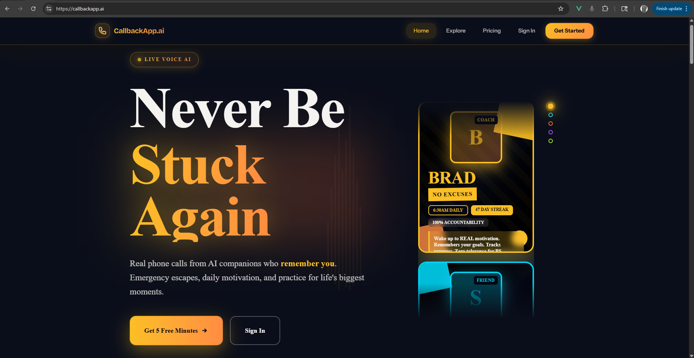
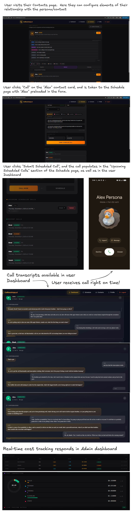
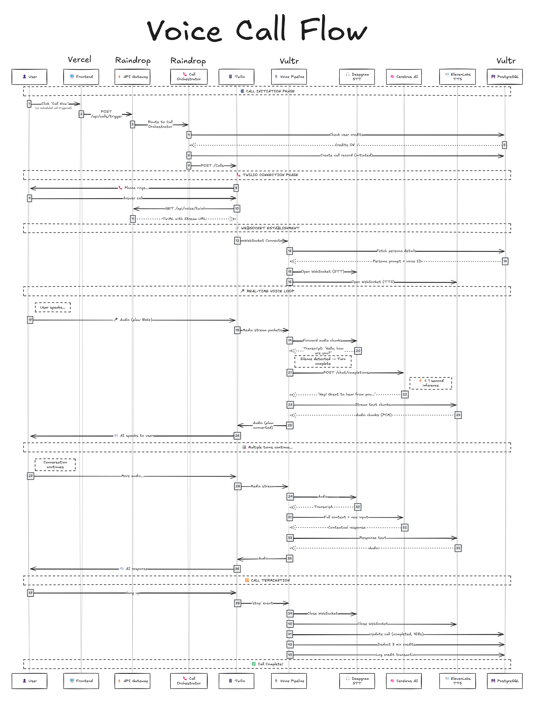
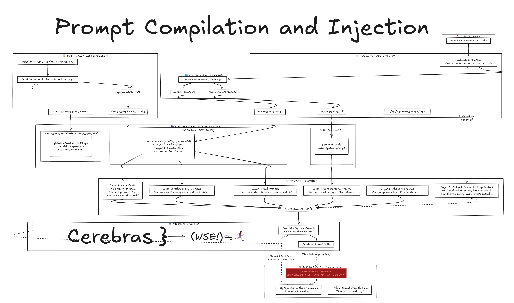
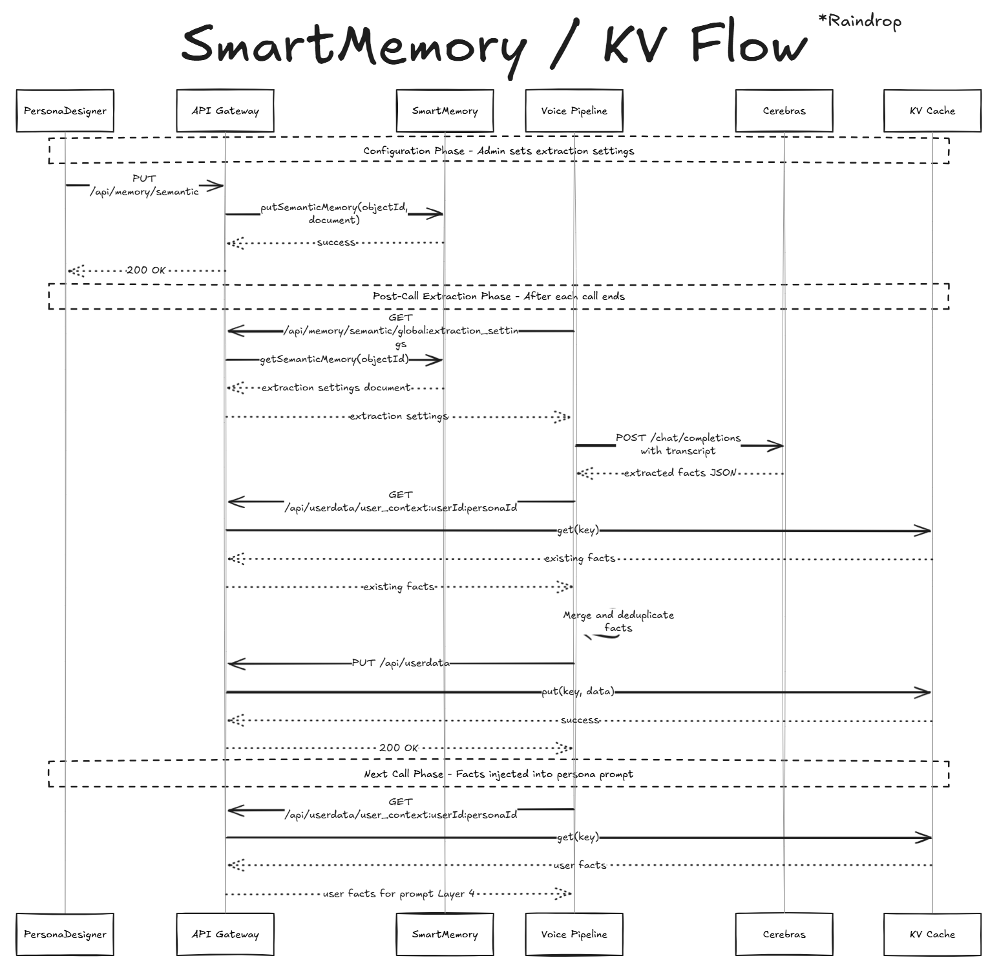
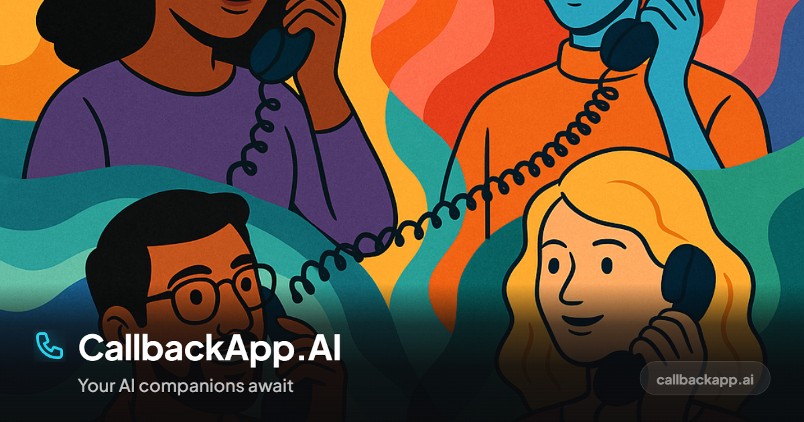

# CallbackApp AI

**Your AI companions are just a phone call away.**

---

**Built for the [AI Champion Ship Hackathon](https://liquidmetal.devpost.com/) by LiquidMetal.AI + Vultr**

---

*AI companions you can actually call—and who remember you.*

**Platform**

**AI & Voice**

**Services**

* Engineered with assistance from [Claude Code](https://claude.ai/code)*

---

## The Problem

**Sometimes you need a call... and no one's available.** Loneliness affects between 20-60% of adults worldwide. But beyond that, life happens at inconvenient times. The 3am anxiety. The pep talk before a big interview. The moment you need to think out loud.

**People need to talk through things:**
- Practice difficult conversations—job interviews, salary negotiations, tough talks with family
- Accountability check-ins for goals and habits (from someone who actually calls)
- Social anxiety practice with low-stakes
- Thinking out loud with a partner who listens and responds

**Life doesn't fit a schedule:**
- Night shift workers, remote workers, travelers across time zones
- Elderly users who struggle with apps but can answer a phone
- Escape calls—"save me from this awkward date"

**Existing solutions forget you.** Every conversation starts from zero. No relationship, no continuity, no one who remembers your dog's name or that you're interviewing at Google next week.

---

## The Solution

**CallbackApp AI** gives you AI companions you can actually *call*—and who *remember* you.

| Feature | Description |
|---------|-------------|
| **Real phone calls** | Your phone rings. You answer. You talk. |
| **Persistent memory** | The AI remembers your life—your job, your family, your ongoing situations |
| **Scheduled callbacks** | Daily check-ins, wake-up calls, accountability reminders, gratitude reminders |
| **Custom personas** | Create AI friends with the personality you want |
| **Sub-second responses** | Natural conversation flow powered by advanced tech |

---

## See It In Action

*3-minute walkthrough of the complete experience*

---

## The User Experience

New users sign up through a production-ready WorkOS authentication flow (email/password, Google, or GitHub OAuth). Once authenticated, they're ready to verify their phone number and start building relationships with AI personas.

*The complete user journey: Configure your relationship → Schedule a call → Receive the call → Review transcripts*

---

## Under the Hood

### Architecture Overview

| Layer | Technology | Purpose |
|-------|------------|---------|
| **Frontend** | Vercel + Vue 3 | SPA with real-time call UI |
| **Backend** | Raindrop (Cloudflare Workers) | API Gateway, KV Cache for user context, SmartMemory |
| **Voice Pipeline** | Vultr VPS | Real-time WebSocket orchestration (Twilio ↔ Deepgram ↔ Cerebras ↔ ElevenLabs) |
| **Scheduler** | Cron Service (Raindrop) | Triggers scheduled calls (daily check-ins, reminders, wake-up calls) |
| **Database** | Vultr PostgreSQL | Personas, users, call history, cost tracking |

**Why multi-cloud?** Cloudflare Workers can't make outbound WebSocket connections—required for real-time voice streaming. A natural and very sound engineering choice is to move the voice pipeline to Vultr while Raindrop handles the API layer at the edge.

---

### The Voice Pipeline

This core innovation brings us **sub-1000ms voice-to-voice latency** through streaming everything.  Liquidmetal's Raindrop at the edge with Cerebras inference is FAST!  Add in the turn-taking capability of Deepgram's new Flux model (originally we used Nova + in-house turn-taking built on top of Silero-VAD.  It was servicable, but not very good), and you have some serously production-ready voice bots.  We plan to explore more APIs and models from ElevenLabs as well, especially for party-line meeting-room scenarios that require diarization (for when you invite your AI companion to talk with one of your friends on the line with you).

*Complete call flow: From button click through Twilio, Voice Pipeline, Deepgram STT, Cerebras inference, ElevenLabs TTS, and back to the user's phone.*
*\*This complete flow represents the phone-call based audio-pipeline.  This app also features a separete, parallel voice pipeline specifically for streaming audio from the browser so that admin's can call and debug personas directly from the Persona Designer without having to use a phone.*

The sequence diagram above shows the full journey of a call:
1. **Call Initiation** — User clicks "Call Now", API Gateway routes to Call Orchestrator, credits checked, Twilio initiates outbound call
2. **WebSocket Establishment** — Phone answers, Twilio connects media stream to Voice Pipeline on Vultr
3. **Real-Time Voice Loop** — Audio streams to Deepgram for transcription, Cerebras generates response, ElevenLabs streams audio back
4. **Call Termination** — Hang up triggers cleanup, credits deducted, call logged to PostgreSQL, SmartMemory extraction completes, and the AI personas retrain memories from your conversations together.

**Key insight:** We use Deepgram Flux for its native turn-taking *events* (`EagerEndOfTurn`, `EndOfTurn`), not just transcription. This enables **speculative response generation**—the AI starts thinking before you finish speaking.  (A version of this concept was built in-house, and Flux is about 10x better)

[Deep dive: Voice Pipeline →](submission_docs/voice-pipeline.md)

#### Prompt Assembly (5-Layer Context Injection)

Before each AI response, we assemble a rich system prompt from multiple data sources. This isn't a static prompt—it's dynamically built for each call based on who's calling, why they're calling, and everything the AI knows about them.  Some elements of the prompt are injected on a per-request basis, allowing the call context to develop purposefully during a single call. (I think we can all agree there is no limit to the complexity that can be wrought when building prompt injection systems with tools like the SmartComponents Raindrop provides.  The prompt compilation and injection layer of the app will be the first feature reveiving post-hackathon attention.  Model selection, prompt structure and size, and improved temporal awareness will bring the personas even more fully to life.)

The 5 layers combine to create contextual, personalized responses:
- **Layer 1 (Core Identity):** The persona's personality, speaking style, and behavioral guidelines
- **Layer 2 (Call Context):** What is the purpose of the user's requsted call (or callback) ("I need help practicing for a job interview")
- **Layer 3 (Relationship):** How long they've known each other, the nature of their relationship
- **Layer 4 (User Knowledge):** Facts extracted from previous conversations (job, family, hobbies, ongoing situations)
- **Layer 5 (Guidelines):** Phone-specific rules like brevity, natural speech patterns, handling interruptions
- **Additional Layers:** Varous prompt elements can be injected during a single conversation.  For example, when a call is approaching the user's max-call duration, the app has the persona tell the user "Hey, we're about done with our time".  That information will be fed into the persona's context so that the persona can maintain a most accurate assessment of what the user and persona are experiencing together.

---

### The Persona Designer (Admin Tool)

Beyond the user-facing app, we built a comprehensive admin tool for designing and debugging personas. This is where most of the prompt engineering happens.

*The Persona Designer showing Alex's configuration: core prompt editor, live "Compiled Final Prompt" preview, and 43 extracted user facts*

**What makes this powerful:**
- **Real-time preview:** See exactly what system prompt the AI receives, including all injected context
- **Layer visibility:** Expand/collapse each layer to understand how context flows
- **Fact inspection:** View all facts the AI has learned about a user across conversations
- **Parameter tuning - persona:** Adjust temperature and token limits per-persona for different conversation styles
- **Parameter tuning - extraction:** Specify temperature, token limits and custom prompts for the end-of-conversation fact extraction phase
- **Multi-persona switching:** Quickly compare how different personas handle similar user contexts

---

### The 11 Microservices

All running on Cloudflare Raindrop:

| Service | Purpose |
|---------|---------|
| `api-gateway` | Request routing, CORS, JWT validation, webhook handling |
| `auth-manager` | User registration, WorkOS OAuth |
| `persona-manager` | Persona CRUD, favorites |
| `call-orchestrator` | Trigger calls, track status |
| `userdata-manager` | KV-backed user preferences |
| `payment-processor` | Stripe checkout sessions |
| `database-proxy` | HTTP → PostgreSQL bridge |
| `log-ingest` | Call logs and analytics |
| `cost-analytics` | Usage dashboards |
| `scheduled-call-executor` | Cron-triggered callbacks |
| `mcp-query-service` | AI-assisted log analysis (Currently unutilized)|

---

### Data & Memory Architecture

**PostgreSQL on Vultr** — 12 tables including:
- `users`, `personas`, `calls`, `credits`
- `user_persona_context` — Per-relationship memory

**Raindrop KV Cache** — 4 namespaces:
- `user_context:{userId}:{personaId}` — Extracted user facts from post-call analysis (Extracted via SmartMemory)
- `rate-limit-cache` — API protection
- `token-blacklist` — JWT revocation
- `call-state` — In-progress call tracking

**Raindrop SmartMemory** — AI-native document storage:
- `global:extraction_settings` — Configurable prompts and parameters for post-call fact extraction (set via Persona Designer)

#### Post-Call Fact Extraction Flow

---

## Cost Economics

We optimized for **real business viability**. The architecture delivers sub-second latency while maintaining healthy margins—Cerebras is the hero here, keeping inference costs low enough that we have room to invest in richer, more sophisticated persona prompts and increased user value as we continue development.

---

## Hardships & Breakthroughs

Building this wasn't an entirely smooth process. Here's some of the real story:

### The WebSocket Audio Nightmare
**12 hours** debugging μ-law audio encoding between Twilio and our pipeline was a slog. Turned out to be a sample rate mismatch. Breakthrough: raw PCM inspection with `ffprobe`.

### Interrupting the Persona
We spent many, many sessions across the entire **Duration of the hackathon** trying to figure out a good way to let the user interrupt the persona.  The complex tech stack that brings us sub-second audio also makes interruptions an engineering challenge; one that we've finally solved\*.  We have some really exciting engineering solutions to test for further improvement, which we will explore after the project resumes.

### The Raindrop ↔ PostgreSQL Bridge
Workers can't connect to external databases directly (I have since realized that maybe a product called Hyperdrive could have solved my issues; knowledge for next time). We built a `database-proxy` service on Vultr that accepts HTTP requests and translates them to SQL. It currently handles 100% of our DB traffic.

### The Turn-Taking Puzzle
Early versions had awful timing—AI would talk over users or wait too long. Deepgram Flux's turn-taking events solved this. We now start generating responses at `EagerEndOfTurn` and abort if the user keeps talking.

### The Voice Pipeline Migration
Cloudflare Workers can't make outbound WebSocket connections—a hard platform limitation we discovered mid-build. The entire voice pipeline had to be extracted and redeployed to a Vultr VPS. What started as a setback became an advantage: Vultr now handles both the voice pipeline and serves as the build server for Raindrop deployments.

### The WSL Near-Death Experience
**8 hours** across two separate WSL crashes that corrupted the development environment. Each time, we thought (and especially me, the human engineer writing this readme file; who was without Claude during times of WSL crashes) the entire project might suffer a terrible fate.  The key is to NOT PANIC and commit/push often... very often.

### Getting Claude to adhere to safe patterns
**We have still not** figured out how to ensure that Claude maintains adherence to safe, script-based patterns when performing operations that require reading, writing or transferring environment variables and other sensitive secrets.  We have designed a number of patterns that do, when followed, prevent environment variables from being exposed to the Claude logs and unsecure means of transfer.  However, getting Claude to keep up with always using the patterns has proved a challenge.

---

## Tech Stack

| Layer | Technology | Purpose |
|-------|------------|---------|
| **Frontend** | Vue 3, Pinia, Tailwind CSS | SPA on Vercel |
| **API** | Cloudflare Raindrop (Hono) | 11 edge microservices/Smart Memory |
| **Database** | PostgreSQL 14 on Vultr | Persistent storage |
| **Cache** | Raindrop KV | Hot data, rate limiting |
| **Voice** | Vultr VPS (Node.js) | WebSocket streaming |
| **STT** | Deepgram Flux | Real-time transcription + turn-taking |
| **LLM** | Cerebras (Llama 3.1 8B) | Sub-200ms inference |
| **TTS** | ElevenLabs (turbo_v2.5) | Natural voice synthesis |
| **Telephony** | Twilio | Outbound/inbound calls |
| **Auth** | WorkOS | OAuth + session management |
| **Payments** | Stripe | Subscriptions + credits |

---

## Letter to the Judges

Building CallbackApp AI has been a six-week journey that made me a better, more relevant engineer.

Every design decision I made was informed and thought out, and the result of intensive research in many cases.  Getting familiar with all of the partenered tech was exciting, and that was just scratching the surface of what's been required to bring an app like this into the light.  What I'm REALLY looking forward to is dialing in the personas with the prompt scaffoling I've built, and to do so with the limited context window of the Llama 8b model (before I start experimenting with larger models and context windows).  I would like to implement more of the SmartComponents and SmartMemory features into my prompt compliation and injection system after the hands-off period concludes.

Having to move one service off Raindrop got me back into thinking like an engineer about *every* resource in this hackathon. Vultr isn't just hosting my voice pipeline and PostgreSQL database—it's now where I build and deploy Raindrop services (after 5 weeks of the `raindrop build` command trying to burn down my laptop). The VPS has become my development workhorse.

This experience opened my eyes to future possibilities. I'm planning to use Cerebras and Vultr together to generate synthetic training data for LoRA fine-tuning of the 8B models my personas use. Cerebras inference is so fast it's worth keeping in the stack for data generation, while Vultr can handle the actual training workloads.

No certificate course on cloud engineering or AI could have offered the lab time I've enjoyed experimenting with these services. The documentation methodology I developed to wrangle the vast research and documentation we (Claude and I) produced into an activly-updated set of useful technical documents and references is its own innovation story that I'm hoping to refine upon independently at a later time. (About 2 weeks into the build, Claude really started producing diminishing returns on my time.  After I designed and ran my first documentation audit and had constructed a Navy-inspired tech manual process, I was back to lightning-fast building)

As far as the current state of the app... we're in "hands-off" mode, the included PUNCHLIST doesn't even scratch the surface of what can and should be done with this app, and the running list of features and possible use-cases keeps getting longer.  I don't want to say "giddy" to describe how I feel about getting back to work on this app, but it's something close to giddy.

Thanks for taking the time to consider and review my app for the 2025 AI Champion Ship Hackathon!  And another thanks for providing the means and the motivation for such a broad, fun and commercially viable build.  I'm looking forward to seeing everyone's submissions and to getting back to CallbackApp.AI once we've all had a good rest.

### Access and Judge Coupon

| Resource | Link |
|----------|------|
| **Live App** | [callbackapp.ai](https://callbackapp.ai) (5 free minutes) |
| **Judge Coupon** | `DEVPOSTJUDGE2025` (50 free minutes) |
Please only use the judge coupon if you are actually a Devpost judge for this hackathon.  Thank you.

---

## Documentation

This project includes 160+ documentation files developed during the hackathon. Selected technical documentation is available in the [submission_docs/](submission_docs/CATALOG.md) folder:

The documentation represents 6 weeks of engineering work across 100+ logged sessions.

| Topic | Document |
|-------|----------|
| **Full Documentation Catalog** | [submission_docs/CATALOG.md](submission_docs/CATALOG.md) |
| **Voice Pipeline** | [submission_docs/voice-pipeline.md](submission_docs/voice-pipeline.md) |
| **Cost Tracking** | [submission_docs/cost-tracking.md](submission_docs/cost-tracking.md) |
| **Punchlist (Roadmap)** | [submission_docs/PUNCHLIST.md](submission_docs/PUNCHLIST.md) |
| **Session Log: WebSocket Fixed** | [submission_docs/session_logs/NEXT_SESSION_LOG_2025-11-22_WEBSOCKET_FIXED.md](submission_docs/session_logs/NEXT_SESSION_LOG_2025-11-22_WEBSOCKET_FIXED.md) |
| **Session Log: Cost Tracking** | [submission_docs/session_logs/NEXT_SESSION_LOG_2025-11-20_COST_TRACKING_IMPLEMENTATION.md](submission_docs/session_logs/NEXT_SESSION_LOG_2025-11-20_COST_TRACKING_IMPLEMENTATION.md) |
| **Session Log: Layer 4 & Turn-Taking** | [submission_docs/session_logs/NEXT_SESSION_LOG_2025-11-26_LAYER4_AND_TURN_TAKING.md](submission_docs/session_logs/NEXT_SESSION_LOG_2025-11-26_LAYER4_AND_TURN_TAKING.md) |
| **Session Log: KV Migration & Strategy** | [submission_docs/session_logs/NEXT_SESSION_LOG_2025-11-26_KV_MIGRATION_COMPLETE_AND_HACKATHON_STRATEGY.md](submission_docs/session_logs/NEXT_SESSION_LOG_2025-11-26_KV_MIGRATION_COMPLETE_AND_HACKATHON_STRATEGY.md) |

---

## Acknowledgments

Built with support from the AI Champion Ship partners:

| Partner | Contribution |
|---------|--------------|
| [**LiquidMetal.AI**](https://liquidmetal.ai) | Raindrop platform, hackathon sponsorship |
| [**Vultr**](https://www.vultr.com/) | Cloud compute, PostgreSQL hosting |
| [**Cerebras**](https://cerebras.ai/) | Lightning-fast LLM inference |
| [**Deepgram**](https://deepgram.com/) | Real-time STT with turn-taking |
| [**ElevenLabs**](https://elevenlabs.io/) | Natural voice synthesis |
| [**Twilio**](https://www.twilio.com/) | Programmable voice infrastructure, telephony |
| [**Stripe**](https://stripe.com/) | Payment processing |
| [**WorkOS**](https://workos.com/) | Authentication |
| [**Cloudflare**](https://cloudflare.com/) | DNS, domains, edge network |

Also featuring these non-partners, but derserve mention.

|   Tech  | Contribution |
|---------|--------------|
| [**Deepgram**](https://deepgram.com/) | Real-time STT with turn-taking |
| [**Twilio**](https://www.twilio.com/) | Programmable voice infrastructure, telephony |

### Development Approach

This is a **vibe-coding hackathon submission**—built with AI assistance from start to finish.

The backend was scaffolded using the **Raindrop MCP workflow**, which provided a solid foundation for the API gateway, smart component bindings, and database proxy patterns. From there, [Claude Code](https://claude.ai/code) served as my engineering partner throughout development.  Claude aided in research, planning, designing architecture, debugging real-time WebSocket issues, and iterating on the voice pipeline.

Over 100 session logs helped me document and structure my time and expertly inform Claude's context during the AI-assisted development process.

---
## Closing Thoughts

I entered this hackathon primairly to survey the partnered technology and find which ones were worth being excited about.  I started with one project (desgined to connect retirees with things to do and people to hang out with), and a few days later pivoted to CallMeBack (no good URL with that in the name existed, and I rather like callbackapp.ai, so here we are: "CallbackApp AI").  As I started to dig in and experience what I could do with access to the partnered tech, this project quickly became something I genuinely wanted to exist in the world.

Loneliness is real, people need access to cognizant interlocutors, and voice creates connection in a way text can't. The engineering challenges were significant; multi-cloud architecture, sub-second latency, designing and compiling personas and their memory; but the goal was simple: **make it feel talking with someon who listens, can take direction and can hold a conversation.** (I also think the pure intrigue of knowing that the person on the other end of that ringing phone isn't a person, but an AI that you summoned to call you, is enough to keep many customer groups engaged.  This app will definitely be used for pure entertainment by some users.)

As we lay this app down for a small respite during the hands-off period, I'm excited to know I'm a more relevant engineer than when I arrived to the project (I was relatively new to claude code) and that I've done well to refresh my skill and knowledge in this ever-widening, vast domain of web development.

### A note on speed ###
I've never built or engineered anything before with such a continued increase in velocity; What I experienced collaborating with Claude during this hackathon is profound.

For most of my life I had held the since that technology passed from one generation to the next as a sort of baton.  During many turnovers, the baton shines far brighter than when it was last turned over; more brilliant and luminsecent, and providing an ever greater means for clarity and knowledge in the future; but always a baton.

Now, as I find the baton coming in-hand, I see clearly that it's no longer a baton giving light, but a rocket; a brilliant, incendary rocket.  Decide where to point it and find a way to hold on tight.  You'll end up somewhere incredible, and hopefully agreeable and a benefit to all.  

Keep buildilng.  Stay creative and positive.  Thanks for checking out my app.

Oh, and to anyone else that submitted a working demo to this hackathon: **Congratulations!  We're pretty much cyborgs now.**

— David

---

## Author

**David Melsheimer**

- GitHub: [melshiD](https://github.com/melshiD)
- LinkedIn: [David Melsheimer](https://www.linkedin.com/in/david-melsheimer-72a0a4137)

---

## License

MIT License — See [LICENSE](LICENSE) for details.

---

  <b>CallbackApp AI</b> — Because sometimes you just need someone to talk to.
    
  <a href="https://callbackapp.ai">🚀 Try the Live App →</a>
    
  <b>Share this project:</b>
    
  
  
  

  

